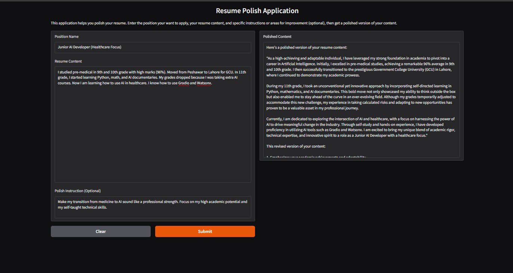
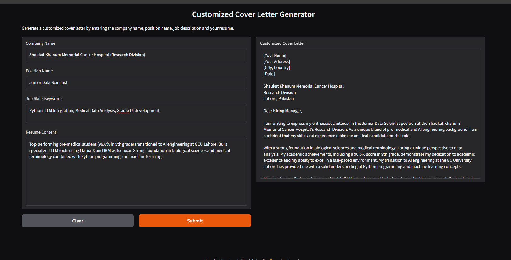
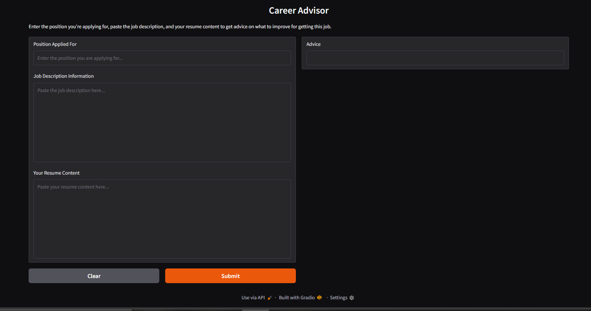

# 🚀 AI-Powered Personalized Job Application Coach

**A comprehensive career optimization suite leveraging Large Language Models to bridge the gap between talent and opportunity.**

## 🌟 Overview

This project is an AI-driven toolkit designed to automate and personalize the job application process. Developed using **Meta's Llama-3.2-11B-Vision-Instruct** foundation model via the **IBM watsonx.ai** platform, the suite provides sophisticated tools for modern job seekers.

As a developer transitioning from a high-achieving pre-medical background at GCU Lahore to a deep immersion in AI, I engineered this suite to handle complex career narratives and provide high-impact technical and strategic advice.

---

## 🛠️ Technical Stack

* **Language:** Python 3.11
* **LLM Engine:** Llama-3.2-11B-Vision-Instruct (via IBM watsonx.ai)
* **UI Framework:** Gradio (Interactive Web Interface)
* **API Integration:** IBM Watson Machine Learning SDK
* **Environment:** Virtualized via Python `venv`

---

## 📂 Project Modules

### 1. AI Resume Polisher

This tool analyzes existing resume content and improves it to align with specific job titles. It utilizes precise prompt engineering to enhance clarity, relevance, and impact.

* **Technical Detail:** Uses a `temperature` of 0.7 to balance factual accuracy with professional creative phrasing.
* **Core Logic:** Zero-shot refinement of bullet points into achievement-oriented statements.



---

### 2. Customized Cover Letter Generator

A dynamic synthesis tool that creates tailored cover letters by analyzing the intersection of a user's resume and a specific job description.

* **Technical Detail:** Implements contextual guardrails to ensure the AI only references experiences present in the user's actual resume.
* **Input Handling:** Manages multi-source data inputs (Company, Role, Job Description, Resume).



---

### 3. Strategic Career Advisor

An analytical engine that acts as a career mentor. It identifies gaps in a user's profile and suggests specific improvements to increase the likelihood of selection.

* **Technical Detail:** Configured with `max_tokens: 1024` to ensure comprehensive, structured, and long-form feedback.
* **Core Logic:** Performs automated gap-analysis between current candidate skills and employer requirements.



---

## ⚙️ Installation & Setup

### 1. Clone the Repository
```bash
git clone https://github.com/Nauman123-coder/AI-Job-Application-Coach.git
cd AI-Job-Application-Coach
```

### 2. Set Up Virtual Environment
```bash
python3.11 -m venv my_env
source my_env/bin/activate  # On Windows use: my_env\Scripts\activate
```

### 3. Install Dependencies
```bash
pip install -r requirements.txt
```

### 4. Run the Applications

Each tool can be launched independently:
```bash
python3.11 resume_polisher.py
python3.11 cover_letter.py
python3.11 career_advisor.py
```

## 📜 Acknowledgments

* **IBM Skills Network:** For the infrastructure and guided project pathways.
---


## ⭐ Show Your Support

Give a ⭐️ if this project helped you land your dream job!
